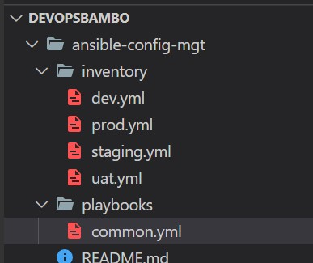
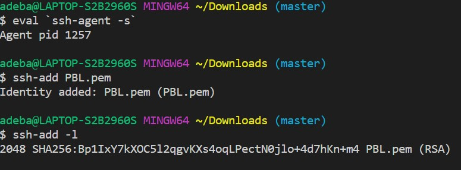
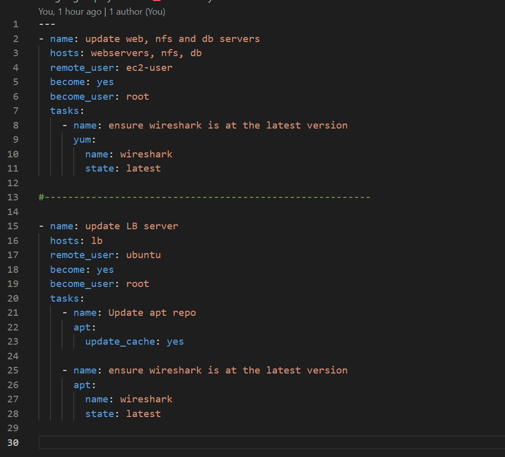

## ANSIBLE CONFIGURATION MANAGEMENT

# Project-11
ANSIBLE CONFIGURATION MANAGEMENT

`sudo apt update`

`sudo apt install ansible`

`ansible-playbook -i /var/lib/jenkins/jobs/ansible/builds/2/archive/inventory/dev.yml /var/lib/jenkins/jobs/ansible/builds/2/archive/playbooks/common.yml`

